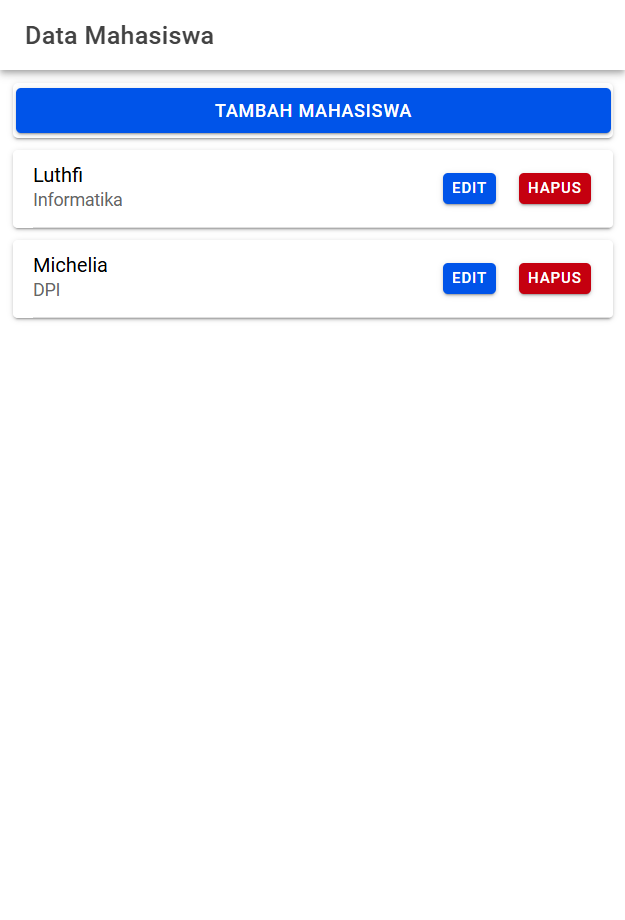
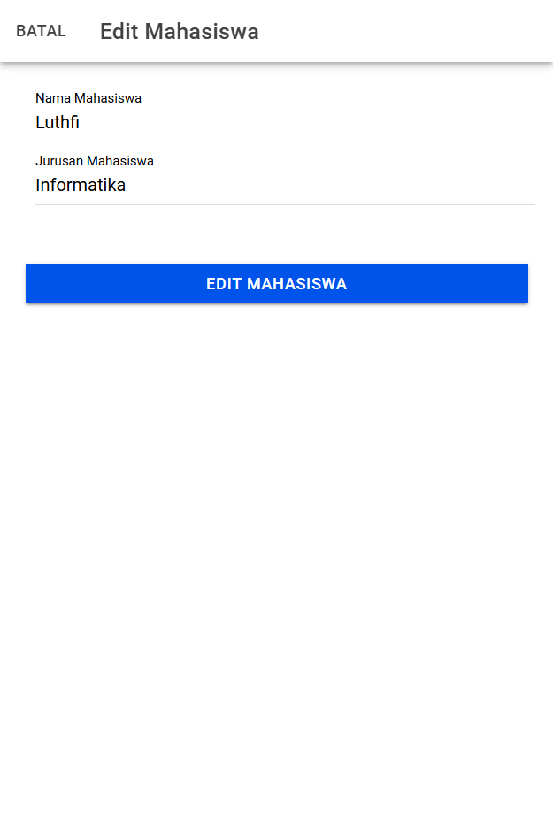

# Tugas 7 - Pertemuan 8

- **Nama** : Luthfi Arie Zulfikri
- **NIM** : H1D022061
- **Shift Lama** : A
- **Shift Baru** : A

---

# Proses CRUD

### 1. Read Data (Menampilkan Data Mahasiswa)

  

Pada tampilan **Read Data**, daftar mahasiswa akan muncul dalam bentuk `ion-card` yang memuat nama dan jurusan setiap mahasiswa yang tersimpan di database. Setiap `ion-card` berisi komponen `ion-label` untuk menampilkan nama dan jurusan, serta dua tombol, yaitu **Edit** dan **Hapus**.
**Alur:**

- Saat halaman `MahasiswaPage` dimuat, fungsi `ngOnInit()` dipanggil.
- `ngOnInit()` menjalankan fungsi `getMahasiswa()` untuk memanggil API `tampil.php`.
- API `tampil.php` mengambil seluruh data mahasiswa dari database dan mengembalikannya dalam format JSON.
- Hasil JSON disimpan dalam `dataMahasiswa`, lalu ditampilkan di dalam elemen `ion-card` yang menyajikan nama dan jurusan mahasiswa.

### 2. Create Data (Menambah Data Mahasiswa)

  

Pada fitur **Create Data**, tampilan modal **Tambah Mahasiswa** akan terbuka ketika pengguna mengklik tombol "Tambah Mahasiswa" pada halaman utama. Modal ini berisi form input yang memungkinkan pengguna untuk memasukkan nama dan jurusan mahasiswa.
**Alur:**

- Pengguna mengklik tombol "Tambah Mahasiswa" yang memanggil `openModalTambah()`.
- `openModalTambah()` membuka modal dan mereset input form dengan memanggil `resetModal()`.
- Pengguna mengisi form nama dan jurusan, lalu mengklik tombol "Tambah Mahasiswa".
- Fungsi `tambahMahasiswa()` mengirimkan data form ke `tambah.php`.
- `tambah.php` menambahkan data baru ke database dan mengembalikan status sukses.
- Jika penambahan berhasil, modal ditutup, dan `getMahasiswa()` dijalankan untuk memperbarui daftar mahasiswa.

### 3. Update Data (Mengedit Data Mahasiswa)

  

Pada fitur **Update Data**, tampilan modal **Edit Mahasiswa** akan terbuka saat pengguna mengklik tombol "Edit" pada salah satu `ion-card` mahasiswa. Modal ini memiliki form yang otomatis terisi dengan data mahasiswa yang dipilih, memungkinkan pengguna untuk memperbarui nama atau jurusan mahasiswa.
**Alur:**

- Pengguna memilih mahasiswa untuk diedit dan mengklik tombol "Edit", yang memanggil `openModalEdit()`.
- `openModalEdit()` membuka modal `Edit Mahasiswa` dan mengambil data mahasiswa melalui `ambilMahasiswa()`.
- `ambilMahasiswa()` memanggil API `lihat.php` untuk mengambil data mahasiswa berdasarkan `id`.
- Data yang diperoleh ditampilkan dalam form, lalu pengguna melakukan perubahan.
- Pengguna mengklik "Edit Mahasiswa", memanggil `editMahasiswa()` untuk mengirim data ke `edit.php`.
- `edit.php` memperbarui data di database, lalu modal ditutup dan daftar mahasiswa diperbarui dengan `getMahasiswa()`.

### 4. Delete Data (Menghapus Data Mahasiswa)

  

Pada fitur **Delete Data**, tombol **Hapus** tersedia di setiap `ion-card` mahasiswa. Ketika tombol ini diklik, sebuah dialog konfirmasi muncul untuk memastikan bahwa pengguna benar-benar ingin menghapus data mahasiswa tersebut. Jika pengguna menyetujui, daftar mahasiswa diperbarui untuk mencerminkan penghapusan.
**Alur:**

- Pengguna mengklik tombol "Hapus" pada data mahasiswa yang ingin dihapus.
- Fungsi `confirmHapusMahasiswa()` menampilkan konfirmasi kepada pengguna.
- Jika pengguna mengkonfirmasi, `hapusMahasiswa()` dipanggil untuk mengakses `hapus.php`.
- `hapus.php` menghapus data mahasiswa berdasarkan `id` dan mengembalikan status sukses.
- Jika berhasil, `getMahasiswa()` dipanggil kembali untuk memperbarui daftar mahasiswa.
